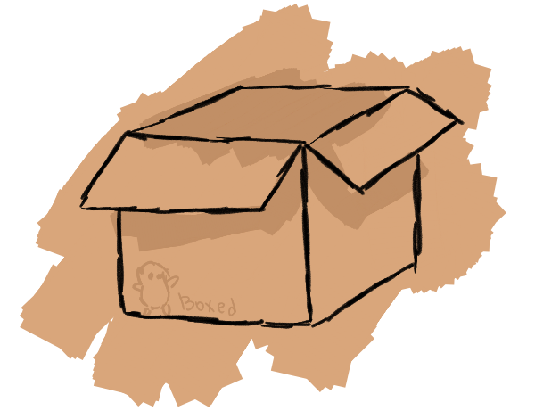

# Boxed
### Boxed is a lightweight, very simple self-hosted file management system

_This project is a work-in-progress._

---
## Installation 

To clone and run this project locally, follow the steps below:

1. Clone this repository:
   ```bash
   git clone https://github.com/your-repo/Boxed.git
   cd Boxed
   ```

2. Install dependencies
   ```bash
   go mod tidy
   ```

3. Make a .env file at the root of the folder:
   ```bash
   touch .env
   ```

4. Set up the .env file via a text editor.
   ```bash
   DB_URL: Database connection URL.
   BACKEND_PORT: Server port.
   FOLDER_PATH: Folder where the server is going to save files.
   JWT_SECRET: JSON Web Token password to sign tokens.
   ```

5. Run the project:
   ```bash
   go run ./cmd/api/main.go
   ```
---

## License 

This project uses a [LICENSE](LICENSE) file. Please check the details before using the code.

---

## Future Plans 

- [x] ~**Thumbnails**~
  ~Enhance file metadata retrieval to include thumbnail IDs for compatible file types (e.g., videos, images) when accessed through relevant API endpoints.~

- [ ] **Frontend**
  While this project is primarily a backend service, creating a default frontend would be valuable, similar to how the `Jellyfin` project operates. This would provide an out-of-the-box user interface for managing files. Additionally, with the [API documentation](), developers should find it straightforward to create custom frontends that consume these endpoints.

- [x] ~**Refactor**~
  ~Improve the current project structure to be more intuitive and inviting for contributors.~

- [ ] **Standardize API responses**  
  Define a consistent response format across the repository (e.g. success, error, metadata) to improve predictability.

- [ ] **Create a CLI tool for `.env` management**  
  Build a CLI utility to initialize and update `.env` files without manual editing.

- [ ] **Add a Makefile for easier server setup**  
  Provide common commands (build, run, test, etc) to facilitate startup.

